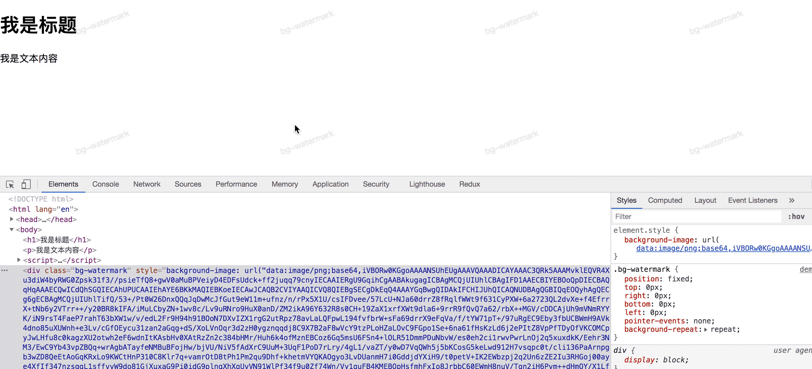
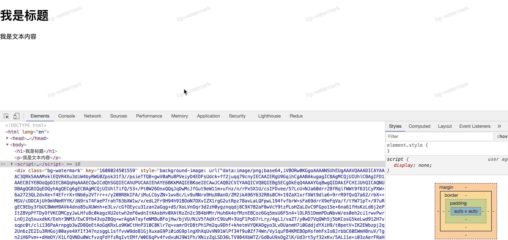
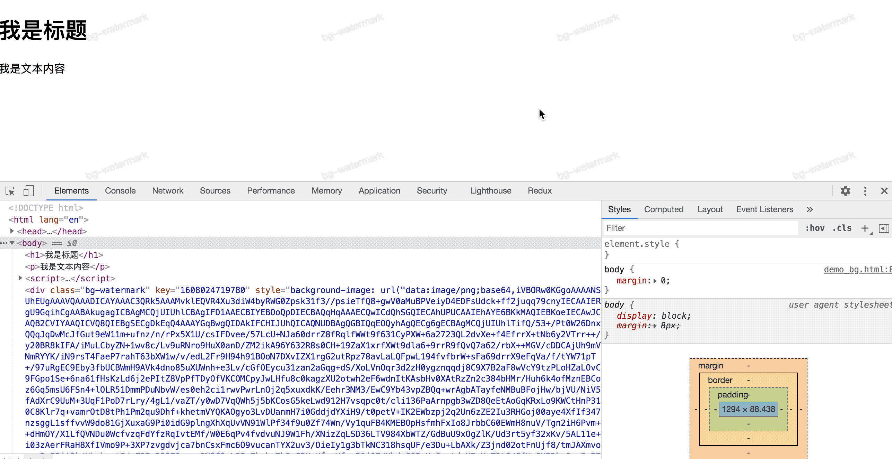
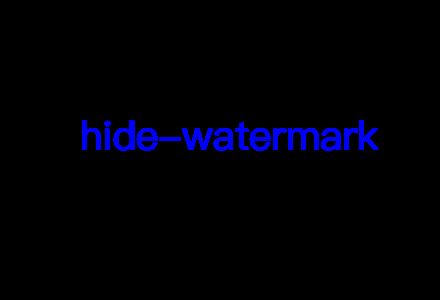
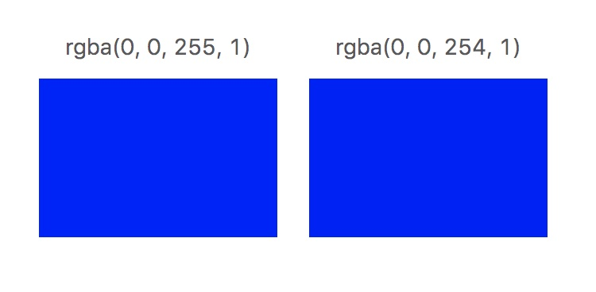
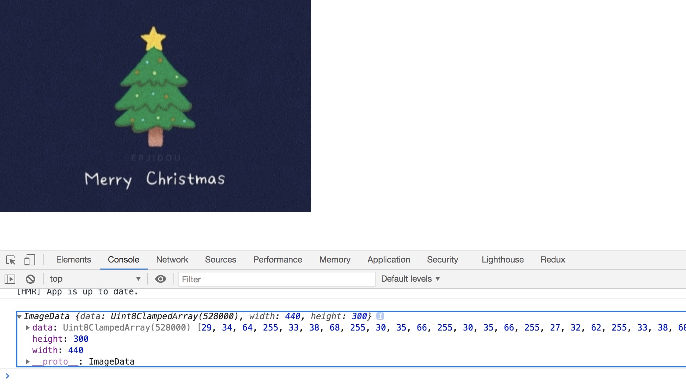

# 利用 canvas 实现各类水印

为了保护版权、防盗，很多网站都会在其图片等资源上或者网站背景添加各类水印。作为前端开发人员，遇到这类需求是很常见的事情，所以水印的添加是一个咱们必备的技能。

其实，各类常见水印，包括图片上的水印、网站背景水印、隐藏的水印等，都是可以通过利用 canvas 进行实现的。下面，就让 canvas 为大家揭开水印神秘的面纱吧。

## 包含表面水印的图片

图片上直接添加水印，是一只十分常见的水印。不管是在资源网站，还是在一些信息分享交流平台，都可以见到添加了水印的图片。如下图，是出自微博的一张图片。我们可以看到在图片右下角有一个标注了用户信息的水印。


实现这类图片的一种常见方式是，对图片进行加工，使用 ps 在图片上添加一个包含水印的图层然后再导出图片。那么作为一名前端开发人员，当然选择使用 canvas 去添加类似这样的水印啦。

我们可以通过使用 canvas 进行绘制该图片。然后在绘制同时，也一起把水印添加到图片上。具体代码实现如下：

```html
<!DOCTYPE html>
<html lang="en">

<head>
    <meta charset="UTF-8">
    <title>Img Watermark</title>
</head>

<body>
    <div>
        <canvas id="img_canvas" width="440" height="300" ></canvas>
    </div>
    <script>
        window.onload = () => {
            //新建img对象 
            let img = new Image();
            img.width = 440;
            img.height = 300;
            img.src = './merryChristmas.jpg';

            // img加载完成
            img.onload = () => {
                //准备canvas
                let canvas = document.getElementById("img_canvas");
                let context = canvas.getContext("2d");
                // 绘制图片
                context.drawImage(img, 0, 0);
                // 绘制水印
                context.font = '12px microsoft yahei';
                context.fillStyle = 'rgba(255, 255, 255, 0.5)';
                context.fillText('@Erin浅伊', 380, 290);
            }
        };
    </script>
</body>
```

## 页面背景加水印

在使用钉钉、语雀的时候，我们都可以看到界面背景，聊天背景都是有添加水印的。


### 实现

对于这一类水印，使用 canvas 实现的主要思路为：

1. 创建带有水印的 canvas
2. 将 canvas 设置为固定定位元素的背景图片

具体代码实现如下：

```html
<!DOCTYPE html>
<html lang="en">

<head>
    <meta charset="UTF-8">
    <title>Bg Watermark</title>
    <style>
        body {
            margin: 0;
        }
        .bg-watermark {
            position: fixed;
            top: 0px;
            right: 0px;
            bottom: 0px;
            left: 0px;
            pointer-events: none;
            background-repeat: repeat;
        }
    </style>
</head>

<body>
    <h1>我是标题</h1>
    <p>我是文本内容</p>
    <script>
        window.onload = () => {
            // 创建带有水印的 canvas
            const angle = -20;
            const canvas = document.createElement('canvas');
            canvas.width = 340;
            canvas.height = 200;
            const context = canvas.getContext('2d');
            context.fillStyle = 'rgba(0, 0, 0, 0.1)';
            context.font = `14px microsoft yahei`;
            context.rotate(-20 * Math.PI / 180);
            context.fillText('bg-watermark', 100, 100);

            // 将 canvas 设置为 div 元素的背景图片 再添加进 body
            const watermark = document.createElement('div');
            watermark.className = 'bg-watermark';
            watermark.style.backgroundImage = `url(${canvas.toDataURL()})`;
            document.body.appendChild(watermark);
        };
    </script>
</body>
```

预览效果如下：


同样的方式，设置为背景的可以换做是 SVG 或者其他图片都是可以实现该类水印的。

### 破解与防御

对于使用以上方法实现水印的，懂开发的人员是轻易就可以破解。打开控制台，直接就可以看到添加了水印背景图片的元素。直接删除该元素，就可以取消该水印的设置。



那我们要怎么防止用户删除这个元素呢？

JavaScript 有提供一个方法 MutationObserver，能跟监控元素的改动。当我们监听到水印所在元素被删除的时候，我们再添加一个，这样就可以对用户删除节点的操作进行防御了。监听代码如下：

```javascript
// 配置需要观察的变动
const config = { attributes: true, childList: true, subtree: true };
// 变动时执行的回调函数
const callback = function (mutationsList, observer) {
    for (let mutation of mutationsList) {
        // 获取移除的节点
        mutation.removedNodes.forEach(function (item) {
            if (item === watermark) {
                // 设置 key 区分新旧节点
                watermark.setAttribute('key', +new Date());
                document.body.appendChild(watermark);
            }
        });
    }
};
// 监听元素
const targetNode = document.body;
// 创建一个观察器实例并传入回调函数
const observer = new MutationObserver(callback);
// 以上述配置开始观察目标节点
observer.observe(targetNode, config);
```

防御效果：



MutationObserver 方法也可以监听元素的属性修改等，并且其对现代浏览的兼容性还是不错的。更多详细介绍请查看 [MDN](https://developer.mozilla.org/zh-CN/docs/Web/API/MutationObserver)

尽管这样防御了，但是其实我们还是可以破解的（嘿嘿嘿～）。

打开 chrome 开发工具的设置，找到 Preferences 栏下 Debugger 模块中的 Disabled JavaScript，点击勾选。在回到控制台就可以删除水印所在节点了。



## 隐藏水印

还有一种隐藏水印，顾名思义，就是看表面是看不出来的，需要后期解析才能看得出水印信息。
如以下图片是包含水印 hide-watermark 的。


直接看是看不出来的，通过解析后可以得出下图。



那么隐藏水印是如何实现的呢？它的原理是什么呢？下文将为你一一解答。

我们在对元素进行设置 CSS 颜色样式的时候，可以使用 rgba(red, green, blue, alpha) 进行设置。显然，像素中是储存了 RGBA 各类值的，而图片也就是由这些像素信息组成的。然而，当 RGBA 每个分量值小范围变动的时候，肉眼是无法分辨的。如下图，将 G 分量加一跟原图进行对比，是完全看不出来区别的。



利用这一特性就可以进行实现隐藏水印。这里先从如何解析包含水印的图开始。

### 解析

回到最初那张包含水印的图，生成它是需要设定某种计算方法的。这个计算方法可以由我们自己去定义，解析的时候是需要利用到这个计算方法的。这里我设定的计算方法是将水印包含的像素值的 B 分量的值为设为奇数（对于这句话，大家可能会有点疑惑，继续看下去，就会明白了）。

将包含水印的图使用 canvas 进行渲染，输出图片的像素信息，可以得到一个非常大的数组（width * height * 4）。数组里面储存的就是像素信息，数组的每个元素表示一个分量的值，每四个元素为一组表示一个像素的信息，依次对应的分量为 R、G、B、A。



代码实现如下：

```html
<canvas id="hide_canvas" width="440" height="300"></canvas>
```

```javascript
let img = new Image();
img.width = 440;
img.height = 300;
img.src = './hide-watermark_01.png';

// img加载完成
img.onload = () => {
    //准备canvas
    let canvas = document.getElementById("hide_canvas");
    let context = canvas.getContext("2d");
    // 绘制图片
    context.drawImage(img, 0, 0);
    // 获取指定区域的canvas像素信息
    imageData = context.getImageData(0, 0, context.canvas.width, context.canvas.height);
    console.log(imageData);
}
```

然而，使得水印现行的办法就是，让包含水印的像素信息的像素显示出来，去除其余干扰像素信息。通过上述计算方法可以得出，我们的解析方法是对数组中 B 分量对应的数组值进行处理，将 B 分量为奇数对应的数组值调节到分量值上限 255，数组其余值调节到分量值下限 0，特别的需要跳过对于 A 分量的处理。最后就可以得到解析过后的图了。代码实现如下：

```javascript
function parsingData (imageData, ctx) {
    var data = imageData.data;
    for(var i = 0; i < data.length; i++){
        if(i % 4 === 2){
            // B 分量
            if(data[i] % 2 === 1){
                data[i] = 255;
            } else {
                data[i] = 0;
            }
        } else if(i % 4 === 3){
            // A 分量不做处理
            continue;
        } else {
            // 去除其余分量干扰信息
            data[i] = 0;
        }
    }
    // 将结果绘制到画布
    ctx.putImageData(imageData, 0, 0);
}
```

### 生成

知道了怎么解析之后，那么生成就是反其道而行之。主要思想为以下几点：

- 分别获取要图片以及水印的像素信息；
- 找到包含水印信息的像素点（目标分量对应数组下标），图片信息中对应的像素点中的目标分量值设为奇数；
- 去除干扰信息，即对应不包含水印信息的像素点，其目标分量值设为偶数。

代码实现如下：

准备 canvas：

```html
<canvas id="hide_canvas" width="440" height="300"></canvas>
```

获取图片像素信息：

```javascript
let img = new Image();
img.width = 440;
img.height = 300;
img.src = './merryChristmas.jpg';

// img加载完成
img.onload = () => {
    //准备canvas
    let canvas = document.getElementById("hide_canvas");
    let context = canvas.getContext("2d");
    // 绘制图片
    context.drawImage(img, 0, 0);
    imageData = context.getImageData(0, 0, context.canvas.width, context.canvas.height);
}
```

获取水印像素信息：

```javascript
context.font = '40px microsoft yahei';
context.fillText('hide-watermark', 80, 150);
const watermarkData = context.getImageData(0, 0, context.canvas.width, context.canvas.height);
```

合并水印像素信息与水印像素信息：

```javascript
function mergeData (imageData, watermarkData, ctx, color) {
    let oData = imageData.data;
    let nData = watermarkData.data;
    let bit, offset;  // offset 的作用是找到 A 分量所在数组下标

    // 不同分量对应数组中的下标位置不同
    switch(color){
        case 'R':
            bit = 0;
            offset = 3;
            break;
        case 'G':
            bit = 1;
            offset = 2;
            break;
        case 'B':
            bit = 2;
            offset = 1;
            break;
    }
    
    for(var i = 0; i < oData.length; i++){
        // 只处理目标分量
        if(i % 4 === bit){
            // A 分量是否为 0 作为判断 所在像素有无像素信息 的依据
            if(nData[i + offset] === 0 && (oData[i] % 2 === 1)){
                // 去除没有信息的像素的干扰
                if(oData[i] === 255){
                    oData[i]--;
                } else {
                    oData[i]++;
                }
            } else if (nData[i + offset] !== 0 && (oData[i] % 2 === 0)){
                // 有信息的像素，目标分量值设为奇数
                if(oData[i] === 255){
                    oData[i]--;
                } else {
                    oData[i]++;
                }
            }
        }
    }
    // 将结果绘制到画布
    ctx.putImageData(imageData, 0, 0);
}
```

这样我们就可以将水印隐藏在普通的图片中了。

在实际应用中，隐藏水印使用的计算方法是更加复杂的方法，例如利用傅里叶变化公式，这里就不做过多阐述了，感兴趣的同学们可以自行去了解。（所有示例代码见[github]()）

## 附录

参考文档

[不能说的秘密——前端也能玩的图片隐写术](http://www.alloyteam.com/2016/03/image-steganography/)

[从破解某设计网站谈前端水印(详细教程)](https://juejin.cn/post/6900713052270755847#heading-15)
